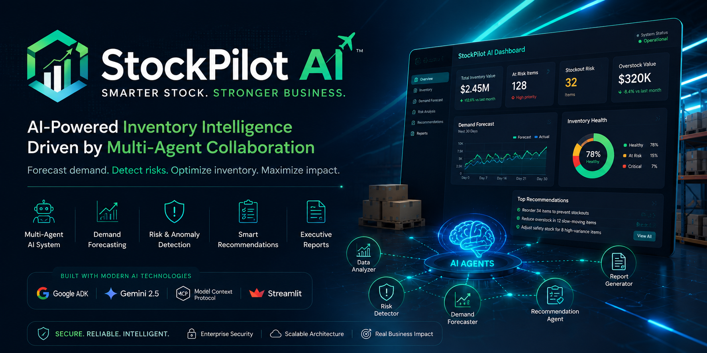
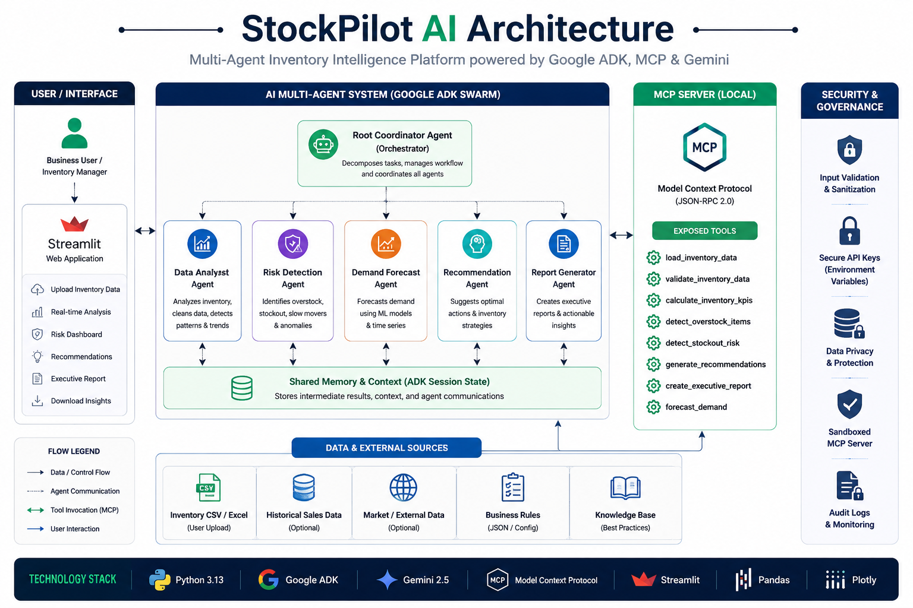
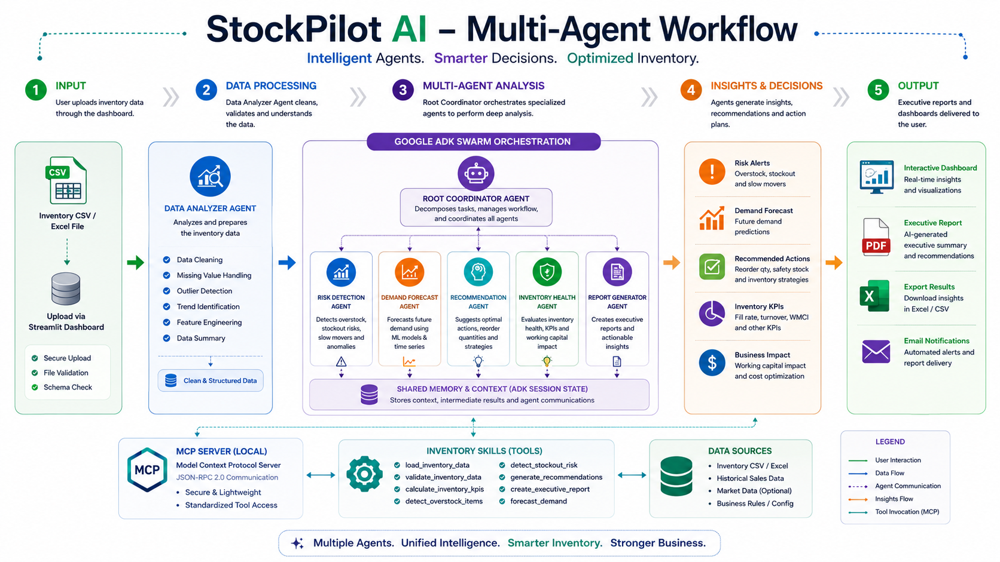
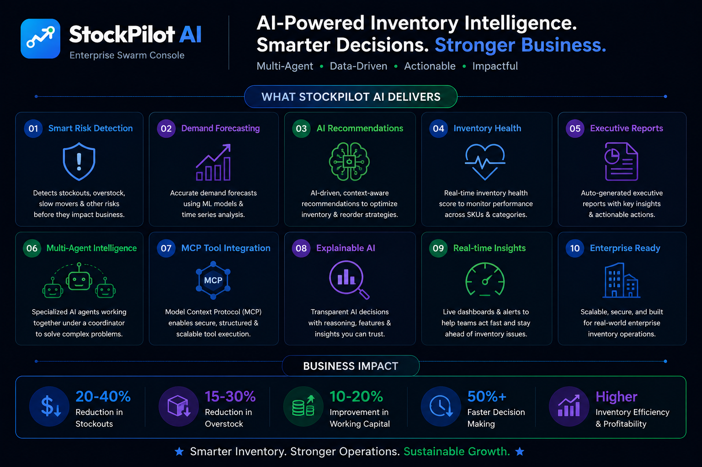

<p align="center">
  
</p>

<h1 align="center">✈️ StockPilot AI</h1>

<h3 align="center">
Enterprise Multi-Agent Inventory Intelligence Platform
</h3>

<p align="center">
AI-powered inventory optimization built with <b>Google Agent Development Kit (ADK)</b>, <b>Gemini 2.5 Flash</b>, <b>Model Context Protocol (MCP)</b>, <b>FastMCP</b>, <b>Python</b>, and <b>Streamlit</b>.
</p>

<p align="center">


</p>

---

# 🚀 Overview

Modern retailers lose significant revenue due to stockouts, overstocking, inaccurate demand forecasting, and slow inventory decision-making. Traditional inventory management systems often rely on static rules and manual analysis, making it difficult to respond quickly to changing business conditions.

**StockPilot AI** is an **Enterprise Multi-Agent Inventory Intelligence Platform** that transforms raw inventory data into actionable business insights using a collaborative swarm of AI agents. Built with **Google Agent Development Kit (ADK)**, **Gemini 2.5 Flash**, and the **Model Context Protocol (MCP)**, the platform enables specialized AI agents to work together to analyze inventory, detect operational risks, forecast demand, optimize procurement decisions, and generate executive-ready business reports.

By combining modular AI orchestration with reusable business intelligence skills, StockPilot AI demonstrates how enterprise organizations can leverage collaborative AI systems to build scalable, explainable, and production-ready decision support applications.

---
## 📚 Table of Contents

- 🚀 Overview
- ✨ Key Features
- 🏗️ System Architecture
- 🤖 AI Agent Responsibilities
- 🔄 Multi-Agent Workflow
- 🛠️ Technology Stack
- 📈 Business Impact
- 🚀 Quick Start
- 📂 Repository Structure
- 🗺️ Future Roadmap
- 🤝 Contributing
- 📄 License

# ✨ Key Features

- 🤖 Multi-Agent Swarm Intelligence powered by Google ADK
- 🧠 Root Coordinator with Specialized AI Agents
- 🔌 Model Context Protocol (MCP) Integration
- 📊 AI-Powered Inventory Health Analysis
- 📈 Demand Forecasting & Sales Velocity Analysis
- ⚠️ Stockout & Overstock Risk Detection
- 💰 Working Capital Optimization
- 📦 Intelligent Procurement Recommendations
- 📄 Executive Business Report Generation
- 🔒 Enterprise-Grade Security & Input Validation
- 🎨 Modern Interactive Dashboard built with Streamlit

---
# 🌟 Project Highlights

✔ Enterprise Multi-Agent AI Architecture

✔ Built using Google Agent Development Kit (ADK)

✔ Powered by Gemini 2.5 Flash

✔ MCP-based Tool Communication

✔ FastMCP Integration

✔ Inventory Health Intelligence

✔ AI Procurement Recommendations

✔ Executive Business Reporting

✔ Interactive Streamlit Dashboard

✔ Modular & Scalable Design

---
# 🏗️ System Architecture

<p align="center">
  
</p>

StockPilot AI follows a modular, enterprise-grade multi-agent architecture where AI reasoning, business logic, and tool execution are cleanly separated. The platform leverages **Google Agent Development Kit (ADK)** to orchestrate specialized AI agents, while **FastMCP** exposes reusable business intelligence skills through the **Model Context Protocol (MCP)**.

The **Root Coordinator Agent** delegates tasks to domain-specific AI agents responsible for inventory analysis, demand forecasting, inventory risk detection, procurement recommendation generation, and executive reporting. Each agent performs a specialized responsibility before collaboratively producing a unified business decision.

This modular architecture improves scalability, maintainability, explainability, and allows new AI capabilities to be integrated with minimal changes to the existing system.

---

# 🤖 AI Agent Responsibilities

| AI Agent | Primary Responsibility |
|----------|------------------------|
| 🧠 Root Coordinator | Orchestrates all AI agents and consolidates final responses |
| 📊 Data Analyzer | Profiles uploaded datasets and computes inventory statistics |
| 📈 Demand Trend Detector | Forecasts demand and analyzes sales velocity |
| ⚠️ Risk Detector | Identifies stockout risks, overstock, and inventory bottlenecks |
| 📦 Recommender | Generates AI-powered procurement recommendations |
| 📄 Report Writer | Produces executive-ready business summaries |

---

# 🔄 Multi-Agent Workflow

<p align="center">
  
</p>

The workflow begins with an uploaded inventory dataset. The Root Coordinator distributes analysis tasks across specialized AI agents, each calling reusable inventory intelligence skills through the Model Context Protocol (MCP). Once all analyses are complete, the Coordinator aggregates the results into an executive report containing inventory insights, demand forecasts, procurement recommendations, and business intelligence.

---

# 🛠️ Technology Stack

| Layer | Technology |
|--------|------------|
| AI Framework | Google Agent Development Kit (ADK) |
| Large Language Model | Gemini 2.5 Flash |
| Agent Communication | Model Context Protocol (MCP) |
| MCP Server | FastMCP |
| Backend | Python |
| Frontend | Streamlit |
| Data Processing | Pandas |
| Data Visualization | Plotly |
| Styling | Custom CSS |
| Environment | Python 3.13 |

# 📈 Business Impact

<p align="center">
  
</p>

StockPilot AI is designed to support data-driven inventory decision-making by combining AI reasoning with business intelligence. Rather than simply analyzing inventory records, the platform helps organizations identify operational risks, optimize procurement strategies, and improve inventory performance through collaborative AI agents.

### Key Business Benefits

- 📉 Reduce inventory stockouts through proactive demand analysis
- 📦 Minimize excess inventory and carrying costs
- 💰 Improve working capital utilization
- 📈 Forecast future inventory demand using AI insights
- ⚠️ Detect inventory risks before they impact operations
- 🤖 Automate procurement recommendations
- 📊 Generate executive-ready business reports
- 🚀 Accelerate strategic inventory decision-making

---

# 🌟 Why StockPilot AI?

Unlike traditional inventory management systems that rely on static business rules, StockPilot AI combines multiple specialized AI agents that collaborate to solve complex inventory challenges.

### Traditional Inventory Systems

- Manual inventory analysis
- Static business rules
- Limited forecasting capability
- Reactive decision-making
- Fragmented reporting

### StockPilot AI

- Multi-Agent AI Collaboration
- Intelligent Demand Forecasting
- AI-Based Risk Detection
- Automated Procurement Recommendations
- Executive Business Intelligence
- Modular & Scalable Architecture
- Explainable AI Decision Support

---

# ✨ Enterprise Features

| Feature | Description |
|----------|-------------|
| 🤖 Multi-Agent Swarm | Specialized AI agents collaborate to solve inventory problems |
| 📊 Inventory Intelligence | Analyze inventory health and operational performance |
| 📈 Demand Forecasting | Forecast demand trends and sales velocity |
| ⚠️ Risk Detection | Identify stockouts, overstock, and inventory bottlenecks |
| 💰 Working Capital Optimization | Improve capital allocation through AI recommendations |
| 📄 Executive Reporting | Generate executive-ready business summaries |
| 🔒 Secure Processing | Input validation, secure API key handling, and safe execution |
| 🚀 Modular Architecture | Easily extendable through MCP tools and reusable skills |

---

# 🚀 Quick Start

Follow the steps below to run **StockPilot AI** locally.

---

## 📦 Clone the Repository

```bash
git clone https://github.com/ankitachotaliya2310/StockPilot-AI.git
cd StockPilot-AI
```

---

## 📥 Install Dependencies

Install all required Python packages.

```bash
pip install -r requirements.txt
```

---

## 🔑 Configure Environment

Create a `.env` file using `.env.example`.

```env
GEMINI_API_KEY=YOUR_GEMINI_API_KEY
GEMINI_MODEL=gemini-2.5-flash
```

---

## ✅ Verify Installation

Run the verification suite to validate MCP tools, AI agents, and reusable skills.

```bash
python -X utf8 verify_system.py
```

---

## ▶️ Launch StockPilot AI

Start the Streamlit application.

```bash
streamlit run app.py
```

Open your browser and navigate to:

```text
http://localhost:8501
```

---

# 📂 Repository Structure

```text
StockPilot-AI
│
├── Assets/
│   ├── Cover.png
│   ├── Logo.png
│   ├── Architecture.png
│   ├── Architecture Overview.png
│   ├── Workflow.png
│   └── business-impact.png
│
├── Datasets/
│   ├── sample_inventory.csv
│   ├── test_dataset_balanced.csv
│   ├── test_dataset_overstocks.csv
│   └── test_dataset_shortages.csv
│
├── doc/
│   └── architecture.md
│
├── agents.py
├── app.py
├── data_generator.py
├── mcp_server.py
├── skills.py
├── tools.py
├── style.css
├── verify_system.py
├── requirements.txt
├── walkthrough.md
├── README.md
├── LICENSE
└── .gitignore
```

---

# 🎥 Demo

📺 **Demo Video:** https://youtu.be/xFnFT3Dh_GI?si=VXuZpmO2-REyzuWL

💻 **GitHub Repository:** https://github.com/ankitachotaliya2310/StockPilot-AI

> The application is designed to run locally using the setup instructions below. A complete demonstration of all features is available in the video above.

---
# 🗺️ Future Roadmap

StockPilot AI is designed as a scalable enterprise inventory intelligence platform. Future enhancements may include:

- 🌐 Multi-Warehouse Inventory Management
- 📡 Real-Time ERP & SAP Integration
- 🤖 AI Supplier Recommendation Engine
- 📈 Advanced Predictive Demand Forecasting
- 📦 Automated Purchase Order Generation
- 🔐 Role-Based User Authentication
- ☁️ Cloud-Native Deployment
- 📊 Real-Time Business Intelligence Dashboard
- 🔔 Smart Inventory Alerts & Notifications
- 🌍 Multi-Language Enterprise Support

---

# 🤝 Contributing

Contributions are welcome!

If you would like to improve StockPilot AI, feel free to:

- Fork the repository
- Create a feature branch
- Submit a Pull Request
- Report bugs or suggest improvements through GitHub Issues

---

# 🙏 Acknowledgements

This project was built using modern AI and data engineering technologies, including:

- Google Agent Development Kit (ADK)
- Gemini 2.5 Flash
- Model Context Protocol (MCP)
- FastMCP
- Streamlit
- Pandas
- Plotly
- Python

Special thanks to the **Google × Kaggle AI Agents Capstone** program for inspiring the development of this project.

---

# 📄 License

This project is licensed under the MIT License.

See the LICENSE file for details.

---

<div align="center">

### ⭐ If you found this project useful, please consider giving it a star on GitHub.

**Built with ❤️ using Google Agent Development Kit (ADK), Gemini, and Streamlit**

</div>
